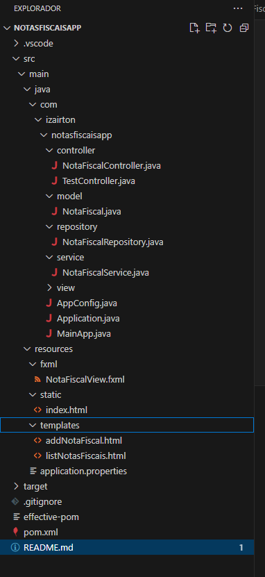

# NotasFiscaisApp

## Descrição

Projeto de aprendizado envolvendo COLABORADORES.

O **NotasFiscaisApp** é uma aplicação Java para controle de notas fiscais, utilizando Spring Boot, Spring Data JPA, PostgreSQL e interfaces gráficas HTML e JavaFX. A aplicação permite adicionar, listar, atualizar e excluir notas fiscais. 

## Funcionalidades

- Adicionar nova nota fiscal
- Listar todas as notas fiscais
- Atualizar uma nota fiscal existente
- Excluir uma nota fiscal

## Tecnologias Utilizadas

- Java 11
- Spring Boot 2.7.3
- Spring Data JPA
- PostgreSQL
- JavaFX (para interface gráfica desktop)
- HTML e Thymeleaf (para interface gráfica web)

## Estrutura do Projeto

A estrutura do projeto está organizada conforme mostrado na imagem abaixo:

## Interfaces Gráficas

### Interface Web

A interface web foi criada utilizando HTML e Thymeleaf. Ela permite que os usuários adicionem e visualizem notas fiscais através de um navegador web.

- `addNotaFiscal.html` - Página para adicionar uma nova nota fiscal.
- `listNotasFiscais.html` - Página para listar todas as notas fiscais.

### Interface Desktop

A interface desktop foi planejada para ser implementada utilizando JavaFX. Ela permitirá a interação com a aplicação através de uma interface gráfica rica em funcionalidades.

- `NotaFiscalView.fxml` - Arquivo FXML para a interface gráfica do JavaFX.

## Estrutura do Código

### Diretórios

- `src/main/java/com/izairton/notasfiscaisapp`
  - `controller` - Contém os controladores da aplicação.
  - `model` - Contém as entidades JPA.
  - `repository` - Contém os repositórios da aplicação.
  - `service` - Contém os serviços da aplicação.
  - `view` - Contém a configuração da aplicação.

- `src/main/resources`
  - `fxml` - Contém os arquivos FXML para JavaFX.
  - `static` - Contém os arquivos estáticos (CSS, JS, etc.).
  - `templates` - Contém os templates HTML para Thymeleaf.
  - `application.properties` - Configurações da aplicação.

### Arquivos Principais

- `Application.java` - Classe principal que inicia a aplicação Spring Boot.
- `MainApp.java` - Classe principal para iniciar a interface JavaFX.
- `AppConfig.java` - Configuração da aplicação.
- `NotaFiscal.java` - Entidade JPA que representa a nota fiscal.
- `NotaFiscalController.java` - Controlador para gerenciar as operações com notas fiscais.
- `NotaFiscalRepository.java` - Repositório para acessar os dados da nota fiscal.
- `NotaFiscalService.java` - Serviço que contém a lógica de negócios da nota fiscal.

## Como Executar

### Pré-requisitos

- Java 11
- PostgreSQL

### Configuração do Banco de Dados

Certifique-se de que o PostgreSQL esteja instalado e em execução. Crie um banco de dados chamado `notasfiscais` e configure as credenciais no arquivo `application.properties`.

### Executando a Aplicação

1. Clone o repositório:

   git clone [https://github.com/IOVASCON/NotasFiscaisApp.git]

   cd NotasFiscaisApp

2. Compile e execute a aplicação:

mvn clean install
mvn spring-boot:run

3 Acesse a aplicação no navegador em [http://localhost:8080].

## Funcionamento da Interface

## Como Acessar a Página HTML

    Inicie a Aplicação:
    Certifique-se de que sua aplicação Spring Boot esteja em execução.

    Acesse a Página no Navegador:
    Abra um navegador e digite http://localhost:8080/index.html na barra de endereços.

## Processo de Adição de Notas Fiscais

1. Preenchimento do Formulário:
O usuário preenche os campos do formulário com os detalhes da nota fiscal (número, data, valor, fornecedor e produto).

2. Envio dos Dados:
Ao clicar no botão "Adicionar Nota Fiscal", os dados do formulário são enviados para o backend usando uma requisição HTTP POST.

3. Processamento no Backend:
O backend Spring Boot processa a requisição, adicionando a nova nota fiscal ao banco de dados.
    1.O controlador NotaFiscalController recebe a requisição POST.
    2.O controlador chama o serviço NotaFiscalService para adicionar a nova nota fiscal ao banco de dados.
    3.O serviço NotaFiscalService usa o repositório NotaFiscalRepository para salvar a nova nota fiscal.

4. Feedback ao Usuário:
Uma mensagem de sucesso ou erro é exibida ao usuário com base no resultado da operação.
    1.O backend retorna uma resposta indicando sucesso ou falha.
    2.O navegador exibe uma mensagem ao usuário com base na resposta recebida.

## Contribuições

Contribuições são bem-vindas! Sinta-se à vontade para abrir issues e pull requests para melhorias e correções.

## Licença

Este projeto está licenciado sob a MIT License.

Este arquivo README.md fornece uma visão geral completa do projeto, incluindo a descrição, funcionalidades, tecnologias utilizadas, estrutura do projeto, interfaces gráficas, estrutura do código e instruções sobre como executar a aplicação.

## SUGESTÕES - Próximos Passos

    1. Validação:
        Adicionar validações mais robustas nos campos do formulário HTML.
        Verificar o tratamento de erros na aplicação.

    2. Segurança:
        Implementar autenticação e autorização se necessário.

    3. Interface do Usuário:
        Melhorar a interface gráfica para torná-la mais intuitiva e amigável.

    4. Documentação:
        Documentar todas as funcionalidades da aplicação e como configurá-la.

**Exemplo de Validações Adicionais:**

Adicionando mais Validações na classe NotaFiscal

@Entity
public class NotaFiscal {

    @Id
    @GeneratedValue(strategy = GenerationType.IDENTITY)
    private Long id;

    @NotNull(message = "O número da nota fiscal é obrigatório")
    @Digits(integer = 10, fraction = 0, message = "O número da nota fiscal deve conter apenas dígitos")
    @Column(unique = true)
    private Long numeroNota;

    @NotNull(message = "A data da nota fiscal é obrigatória")
    @Pattern(regexp = "\\d{2}/\\d{2}/\\d{4}", message = "A data deve estar no formato dd/MM/yyyy")
    private String dataNota;

    @NotNull(message = "O valor da nota fiscal é obrigatório")
    @Digits(integer = 10, fraction = 2, message = "O valor da nota fiscal deve ser um número válido")
    private BigDecimal valorNota;

    @NotNull(message = "O fornecedor é obrigatório")
    @Size(min = 2, max = 100, message = "O fornecedor deve ter entre 2 e 100 caracteres")
    private String fornecedor;

    @NotNull(message = "O produto é obrigatório")
    @Size(min = 2, max = 100, message = "O produto deve ter entre 2 e 100 caracteres")
    private String produto;

    // Getters and setters
    // ...
}
